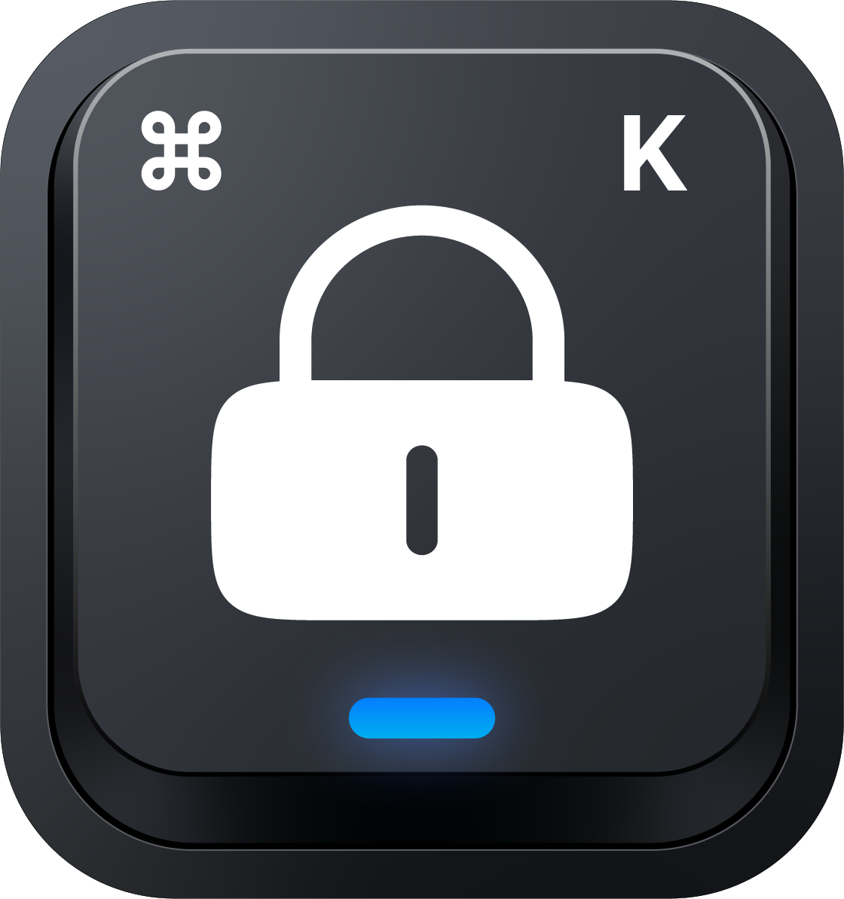

# KeyLock



Lock your MacBook keyboard for a few minutes so you can wipe it down without
typing nonsense into whatever is open. The mouse and trackpad stay live — that
is the only way back out.

macOS has no built-in way to do this. KeyLock installs a `CGEventTap` that
swallows every `keyDown`, `keyUp`, and `flagsChanged` event. One Swift file, no
dependencies, no Homebrew, no background daemon — the tap dies with the process.

## Install

**Quick way:** grab `KeyLock.dmg` from
[Releases](https://github.com/nixentric/keylock/releases), open it, drag KeyLock
into Applications.

The build is ad-hoc signed, so Gatekeeper will block the first launch. Right
click the icon › **Open** › **Open**, or:

```bash
xattr -dr com.apple.quarantine /Applications/KeyLock.app
```

## Build it yourself

Needs the Xcode Command Line Tools (`xcode-select --install`). Full Xcode is not
required.

```bash
git clone https://github.com/nixentric/keylock.git
cd keylock
./build.sh
```

You get `KeyLock.app` and `KeyLock.dmg` in the same folder. `build.sh` compiles
`keylock.swift` with `swiftc`, composites `logo.png` into `AppIcon.icns`, writes
`Info.plist`, ad-hoc signs the bundle, runs the self-test, and wraps it all in a
disk image.

Two variables at the top of [`build.sh`](build.sh) are the ones worth editing:

| Variable  | What it does                                                     |
| --------- | ---------------------------------------------------------------- |
| `VERSION` | Bundle version, compared against the latest release tag           |
| `REPO`    | `owner/repo` for the update check. Leave empty to turn it off     |

## Accessibility permission

Blocking the keyboard requires Accessibility access. Launch KeyLock and it opens
a setup screen: click **Open System Settings**, flip the KeyLock switch under
Privacy & Security › Accessibility, then come back. The lock screen starts on its
own the moment the permission lands — no relaunch needed.

The grant is tied to that exact copy of the app. After a rebuild, or after moving
the app somewhere else, flip the switch again.

## Use it

Open KeyLock. The screen goes dark, the keyboard goes dead, and the remaining
time is shown on screen.

**To unlock:** hold the *Hold to unlock* button for 1.5 seconds. A deliberate
hold, not a click, so a cloth brushing the trackpad cannot let you out. Leave it
alone and the lock lifts by itself when the timer runs out.

The default is 5 minutes. To change it:

```bash
open -a KeyLock --args --seconds 120
```

While locked, the Dock, the menu bar, and app switching are all disabled
(`NSApplicationPresentationOptions`), so do not set `--seconds` absurdly high.

**What it cannot block:** the power button, Touch ID, and a hold-to-force-restart.
Those live below the event tap, in hardware. Keep the cloth away from them.

## Update check

On launch KeyLock asks GitHub for the latest release
(`/repos/OWNER/REPO/releases/latest`) and compares `tag_name` against the bundle
version. If something newer exists, one notice line appears on the lock screen.
It runs asynchronously so it never delays the lock, and stays quiet when offline.
This is not auto-update — downloading is still a manual trip to Releases.

## Cutting a release

```bash
gh release create v1.1.0 KeyLock.dmg --title "KeyLock 1.1.0" --notes "What changed"
```

Bump `VERSION` in `build.sh` first, run `./build.sh`, then cut the release. The
tag has to match `VERSION` or the comparison is meaningless.

## Tests

```bash
KeyLock.app/Contents/MacOS/KeyLock --selftest
```

Covers which events get swallowed, `--seconds` parsing, and version comparison.
`build.sh` runs it on every build.

## License

MIT
